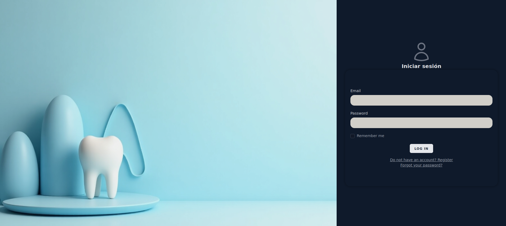
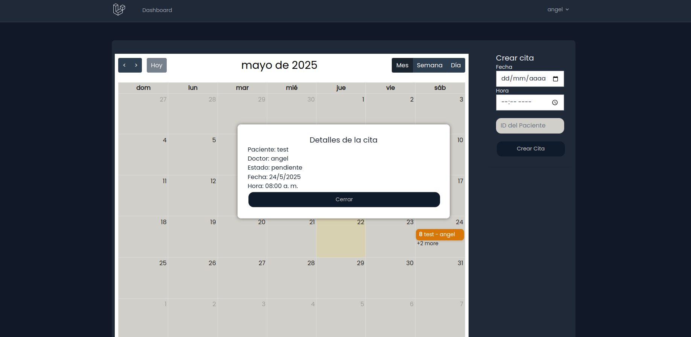
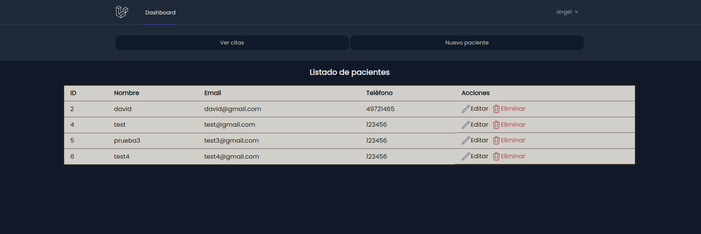
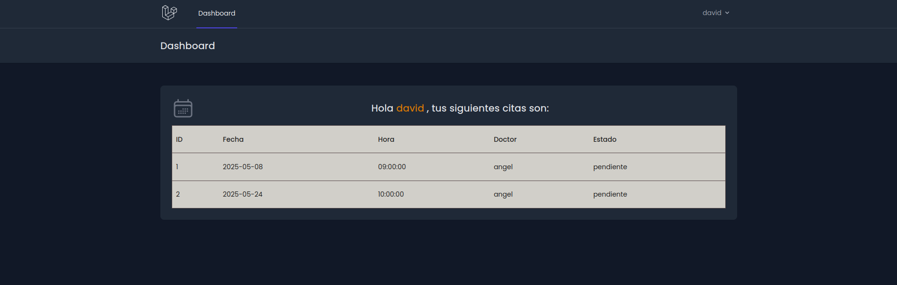

# Aplicación sencilla de gestión de citas médicas (Laravel 10)

Desarrollado por Angel Torcelli

## Resumen
Esta es una aplicación sencilla de gestión de citas médicas, desarrollada en Laravel 10. La aplicación permite a los doctores gestionar (CRUD) cuentas de pacientes y crear citas utilizando un calendario. Los pacientes pueden registrarse por su cuenta, asi como visualizar cuando tienen citas programadas. La aplicación incluye un sistema de autenticación y autorización, lo que permite a los doctores y pacientes acceder a diferentes funcionalidades según su rol.

Tecnologías utilizadas:
- PHP (Laravel 10)
- MySQL
- Breeze (para autenticación)
- Tailwind CSS
- FullCalendar (para el calendario)

## Inicio y login

## Vista doctor

## Vista paciente

